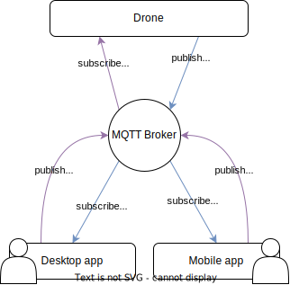

MQTT
##########

Message Queuing Telemetry Transport (MQTT) is a publish/subscribe messaging protocol that works on top of TCP/IP protocol.
We have a set of clients that are subscribed to a certain type of telemetry and/or are publishing some telemetry.
Then, a broker is in charge to distribute this telemetry.

In this case, we have the drone that is publishing it's telemetry and the users are subscribed to that telemetry.
In the other hand, the user are publishing commands and the drone is gathering them.

MQTT Broker
*************

The MQTT broker is the backend system which coordinates messages between the different clients.
Responsibilities of the broker include receiving and filtering messages, identifying clients subscribed to each message and sending them the messages.
It is also responsible for other task such as:

* Authorizing and authenticating MQTT clients

* Passing messages to other systems for further analysis

* Handling missed messages and client sessions

MQTT Client
*************

An MQTT client is any device from a server to a microcontroller that runs an MQTT library. 
If the client is sending messages, it acts as a publisher, and if it is receiving messages, it acts as a receiver.
Basically, any device that communicates using MQTT over a network can be called an MQTT client device.

Links
*******

* `Introduction to MQTT <https://learn.sparkfun.com/tutorials/introduction-to-mqtt/all>`_

* `What is MQTT? <https://aws.amazon.com/what-is/mqtt>`_