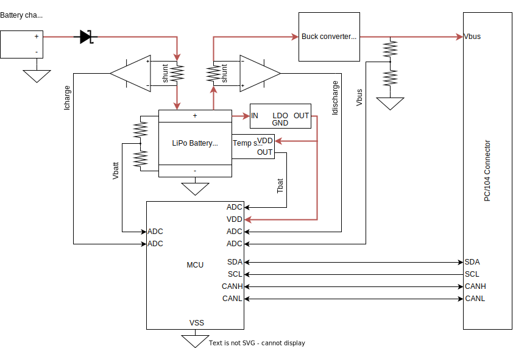

*************************
Electronic Power Supply
*************************

The Electronic Power Supply (EPS) must provide the energy to the rest of the system.
As we can see in the following image, the EPS system is centered around the battery.
The main objective of the EPS is monitor the state of the battery and send telemetry about it through a CAN interface (using DroneCAN protocol).

There are certain parameters of the battery that need to be monitored to ensure that it is still healthy.

In first place, the voltage of each single cell of the battery must be monitored. 
If a cell's voltage drops below a certain limit, this can decrease its charge storage capacity or even can cause a shortcircuit.
On the other hand, if the voltage of a cell rises above a certain limit, a total thermal runaway or short circuit can occur, generating flames and smoke.
Therefore, the EPS should measure the voltage of each single cell of the battery.

To charge several cells at the same time, it is necessary that they all have the same voltage to avoid damaging any of them.
Also, it is important to note that Lithium cell should not be charged too quickly, as this may increase their temperature excessively and reduce its useful life. 

.. toctree::
    :maxdepth: 2
    :caption: Contents:

    titles/battery

Links
#######

* [Cubesat EPS introduction][http://www.ece3sat.com/cubesatmodules/eps/]

* [DroneCAN][https://dronecan.github.io/]

* [AP_PERIPH CAN-L4-BM][http://www.mateksys.com/?portfolio=can-l4-bm#tab-id-2]

* [Single cell voltage monitoring][https://bitdrivencircuits.com/Battery_Monitor/batteryMonitor_home.html]

* [Diseño de un sistema de gestión y almacenamiento de energía solar para nodos IOT][https://academica-e.unavarra.es/bitstream/handle/2454/45693/Diseno%20de%20un%20sistema%20de%20gestion%20y%20almacenamiento%20de%20energia%20para%20nodos%20IoT%20-%20Raul%20Arribas.pdf?sequence=1&isAllowed=y]