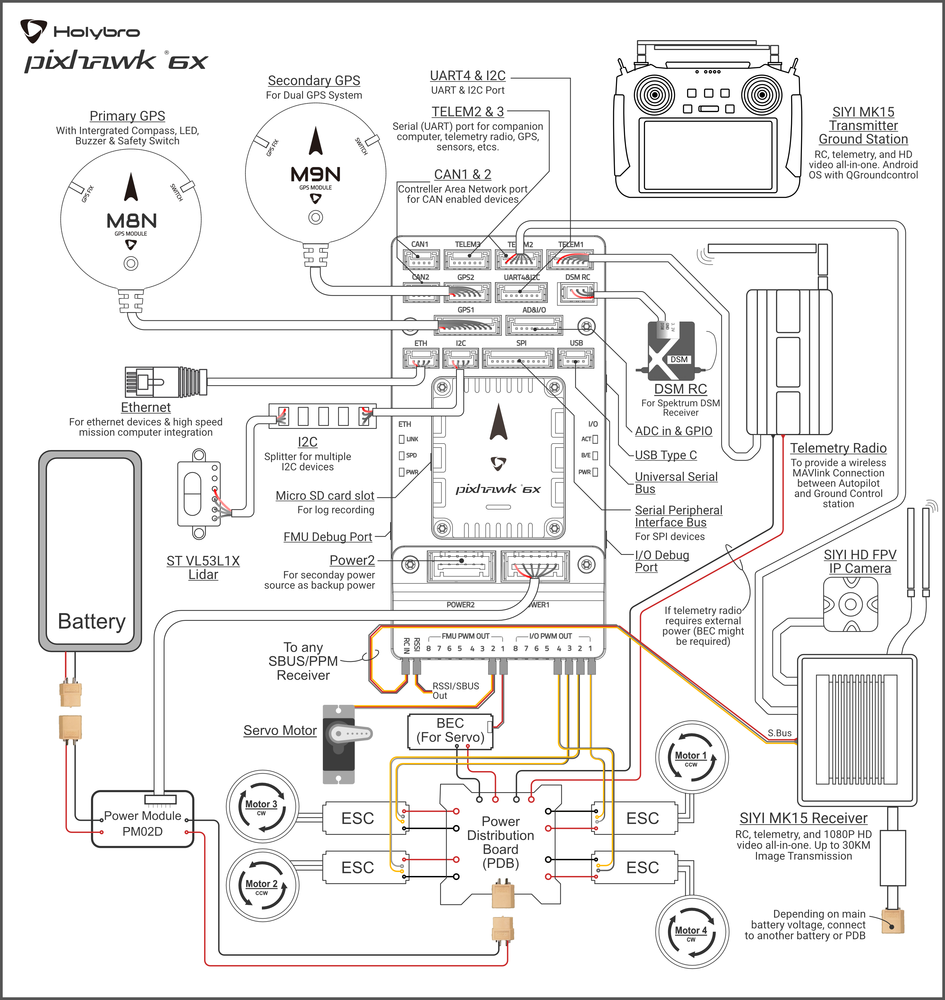

Holybro Pixhawk 6X
####################

The Pixhawk 6X is composed by 2 PCBs: the Pixhawk 6X and the base board.
This provides a modular design, where the Flight Module Unit and a base board exposing interfaces are 2 separate boards.
You could design a different base board but use the same Pixhawk 6X as a FMU.

The Pixhawk 6X contains a STM32H752 (Cortex M7) and redundant sensors (3 IMU and 2 barometers).
The power domains of the sensors are separated, guaranteeing a true triple redundancy module.

The base board have an STM32F103C8T7 which is connected to the STM32H752 of the Pixhawk 6X through some serial interfaces (USART).
The STM32F1 brings some new interfaces I/O interfaces to the whole system.
Also, the base board exposes some interfaces of the STM32H7 (for example, the UART for the GPS).

Cost
*****

The overall cost of a Pixhawk drone computer is the following:

+------------------+-------------+
|Part              | Cost [$USD] |
+==================+=============+
|Pixhawk 6X        | $515        |
+------------------+-------------+
|Pixhawk Baseboard | $102        |
+------------------+-------------+
|Total             | $617        |
+------------------+-------------+

Links
*******

* `Holybro Pixhawk 6X in PX4 doc <https://docs.px4.io/main/en/flight_controller/pixhawk6x.html>`_

* `Holybro Pixhawk 6X in Holybro doc <https://docs.holybro.com/autopilot/pixhawk-6x/overview>`_

* `Pixhawk 6X in Amazon <https://www.amazon.com/-/es/HolyBro-M%C3%B3dulo-Pixhawk-6X-FC/dp/B0C5D3TQRW/ref=sr_1_4?__mk_es_US=%C3%85M%C3%85%C5%BD%C3%95%C3%91&crid=Q2OB8YSDG0N0&keywords=Pixhawk%C2%AE%E2%80%8B+6X&qid=1689768196&sprefix=pixhawk+6x%2Caps%2C659&sr=8-4>`_

* `Pixhawk Baseboard in Holybro shop <https://holybro.com/products/pixhawk-baseboards>`_