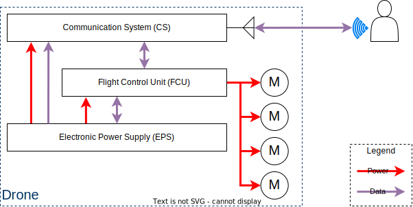

System overview
====================================================

Raccoon Drone is a quadrotor X. The system is divided in 3 big blocks:

* The **Flight Control Unit** (FCU) is in charge of:

 * Run High-Level Finite State Machine (HL-FSM), determining what actions the drone should take at all times.

 * Executing flight control software, running control algorithms and moving motors.

* The **Electronic Power Supply** (EPS) must provide power to the rest of the system.
  Also, is in charge to collect information about the power system and send it to the FCU and CS.

* The **Communication System** (CS) have the responsibility to send the data to the operator.
  Have an antenna to send data through a wireless channel.

Links
------
